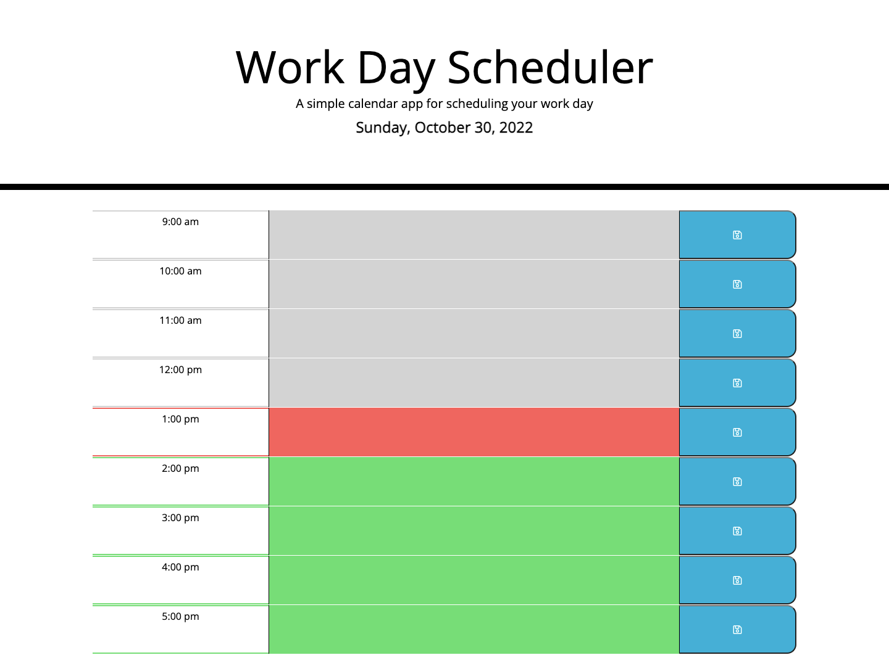

# Daily Planner (Web Application)

## Description

Users can access this web application to plan their events for the current business day. On this daily planner, users can find the current date and enter and save their events in the time blocks provided. The time blocks are displayed in various colors to represent the current time period as well as the previous and future time periods. The saved events are stored and displayed.   

The codebase for this daily planner can be accessed via the links below. The use of jQuery and local storage can be observed from there. 

## Links and Usage 

To access the deployed application, please visit: https://jamscc.github.io/web-app-daily-planner/

Users can access the codebase in Chrome by navigating to Chrome DevTools. The codebase can also be accessed via the following link:

https://github.com/jamscc/web-app-daily-planner

## Screenshot

The following is the screenshot for the web application:

